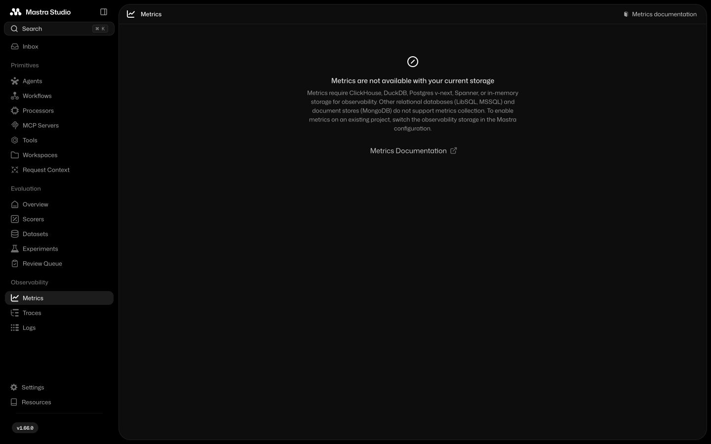
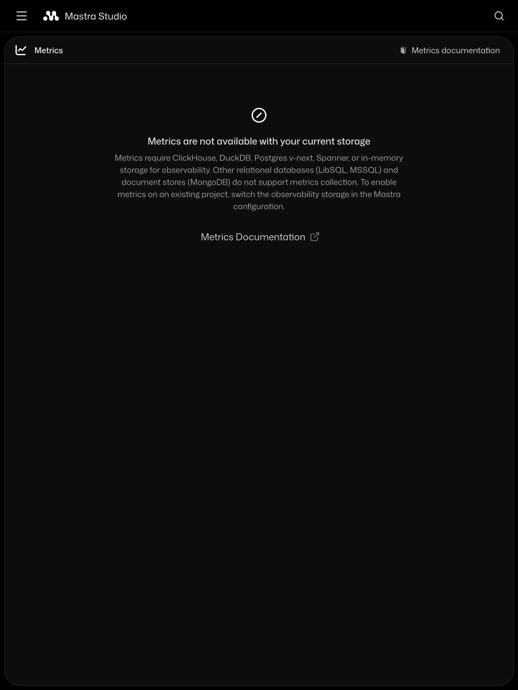
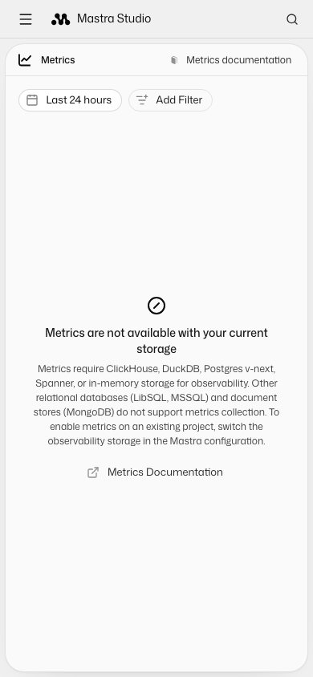
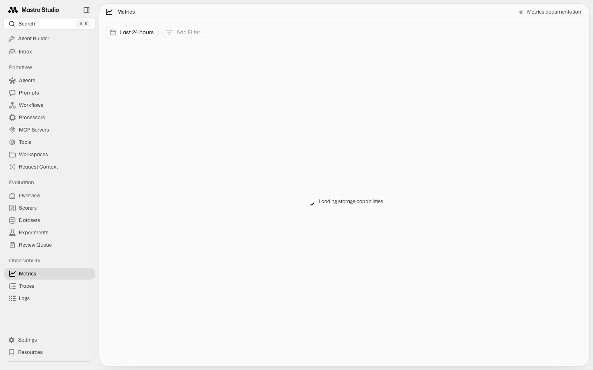
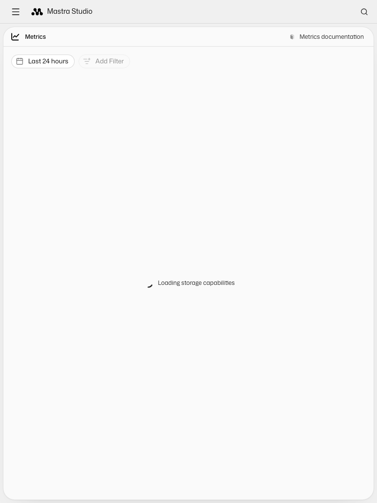
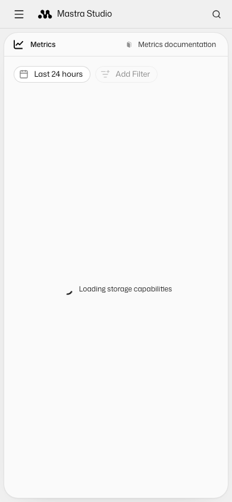

# Mastra Studio: requests against unsupported observability storage

Minimal reproduction using LibSQL, with no agents, API keys, authentication, or external services.

## Run

Requires Node.js >=22.13.0 and npm.

```sh
npm ci
npm run dev
```

The server binds only to `127.0.0.1:4199`.

1. Open http://127.0.0.1:4199/inbox in Chrome.
2. Open DevTools Network and filter for `/api/observability/feedback`.
3. Leave the page idle. The request with `perPage=1` keeps returning HTTP 500 in repeated bursts. The page says `This storage provider does not support listing feedback`.
4. Navigate to Metrics using the sidebar.
5. The page says `Metrics are not available with your current storage`, but the Network panel shows requests to `/api/observability/metrics/aggregate` and discovery endpoints. The sidebar feedback requests also continue.

The same configuration can be bundled with `npm run build` (`mastra build --studio`); this reproduction was verified using `npm run dev`.

## Expected

- A permanent feedback capability error should stop automatic polling.
- Metrics and filter discovery should not run while capabilities are loading or after the store is known to lack metrics support.
- Transient failures should remain recoverable, and supported stores should continue to load normally.

## Observed

Verified in Chrome on macOS, with Node.js 24.14.0, using the committed npm lockfile:

- `mastra`: 1.29.0
- `@mastra/core`: 1.66.0
- `@mastra/libsql`: 1.22.5
- `@mastra/observability`: 1.17.7

The feedback handler error count increased from 84 to 112 between 18:58:18 and 18:58:42 UTC on 2026-09-12, including navigation from Inbox to Metrics. No feedback action was taken.

On Metrics, the server recorded 16 failed aggregate requests and four failed requests each for entity names, service names, and environments. This is a retry burst; the indefinite polling was verified for the feedback count. No storage changes can result from retrying these unsupported operations.

Blocked analytics requests from browser extensions are separate from this issue.

## Configuration

See [`src/mastra/index.ts`](src/mastra/index.ts). An in-memory **LibSQL** database is still LibSQL; it is not the separate `InMemoryStore` provider that supports metrics.

## Proposed fix

Reported upstream as [mastra-ai/mastra#23745](https://github.com/mastra-ai/mastra/issues/23745).

The proposed Studio patch is in [mastra-ai/mastra#23816](https://github.com/mastra-ai/mastra/pull/23816), on [the contribution branch](https://github.com/kessiler/mastra/tree/hotfix/studio-unsupported-storage-requests).

To inspect the fixed UI against this reproduction, leave `npm run dev` running here, then in that Mastra branch:

```sh
pnpm install --frozen-lockfile
pnpm turbo build --filter '@internal/playground^...'
HOST=127.0.0.1 PORT=4199 pnpm --filter ./packages/playground exec vite --host 127.0.0.1 --port 5199
```

Open http://127.0.0.1:5199/inbox and http://127.0.0.1:5199/metrics. Initial feedback requests can still exhaust the bounded SDK/query retries before reporting the error, but the sidebar's recurring polling stops afterward. In browser verification, the feedback error count stayed unchanged over a 36-second idle interval after the initial requests settled. The patched Metrics page issued no additional aggregate or unsupported discovery requests.

The unsupported Metrics view retains the date selector and URL filter controls. Changing the date preset or loading `/metrics?period=24h&filterEnvironment=production` should update the controls without sending aggregate or discovery requests. Inbox, trace, and span feedback use one shared polling policy for permanent storage errors.

Screenshots below show this branch's built Studio running against the local LibSQL kitchen-sink fixture:

| Desktop (1440 x 900) | Tablet (768 x 1024) | Mobile (390 x 844) |
| --- | --- | --- |
|  |  |  |

While the capability request is pending, Studio keeps the date controls visible, disables filter editing, and displays a loading indicator. Metrics and discovery requests remain gated during this state. The screenshots below delay only the capability response from the same local fixture:

| Desktop (1440 x 900) | Tablet (768 x 1024) | Mobile (390 x 844) |
| --- | --- | --- |
|  |  |  |

## Contribution workspace setup

Run these commands from the Mastra contribution checkout, not this reproduction. Use the Node.js version supported by Mastra and the pnpm version pinned by its `packageManager` field (11.21.0 at the time of this update). Build the internal packages before collecting tests: a dependency install alone does not produce the exported files used by `@mastra/react` and `@mastra/playground-ui`.

```sh
pnpm install --frozen-lockfile
pnpm exec turbo run build --filter=@internal/playground
pnpm --filter ./packages/playground exec vitest run src/domains/feedback/hooks/__tests__/use-feedback-polling.msw.test.tsx src/pages/metrics/__tests__/index.msw.test.tsx
pnpm --filter ./packages/playground typecheck
```

For the existing Metrics browser spec, build the CLI and the fixture's additional workspace dependencies, install the fixture and Chromium, then point the dev server at this branch's Studio build:

```sh
pnpm exec turbo run build --filter=./packages/cli --filter=@mastra/editor --filter=@mastra/memory --filter=@mastra/libsql --filter=@mastra/loggers --filter=@mastra/mcp
pnpm install --dir packages/playground/e2e/kitchen-sink --no-frozen-lockfile
pnpm --filter ./packages/playground exec playwright install chromium
MASTRA_STUDIO_PATH="$PWD/packages/playground/dist" pnpm --filter ./packages/playground exec playwright test -c e2e/playwright.config.ts e2e/tests/metrics/page.spec.ts --reporter=list --retries=0
```

The browser spec starts its own local server on port 4111. Its memory-card case skips with LibSQL because that provider does not support metrics; the other cases exercise the date control, URL filter, and period change.
